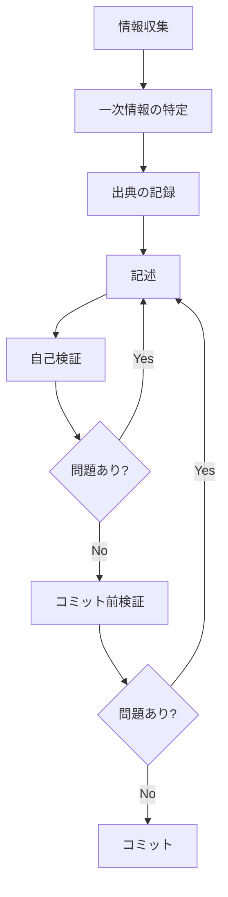

# ドキュメント作成ワークフロー

このガイドは、ドキュメントの品質を保証するための作業プロセスを定義します。

> **本サイトは Kiro Web 版です。** Kiro Web には**バージョン番号が存在しません**。
> IDE/CLI 版のワークフローにある「版番号」を軸にした手順は、本サイトでは
> 「**日付＋スラッグ**」と「**構造による粒度判定**」に置き換わっています。

---

## 📋 作業フロー



---

## 1️⃣ 情報収集

### 一次情報の優先順位

上位が下位を上書きします。**下位のみを根拠に記述してはいけません**。

| 順位 | 情報源 | URL | 用途 |
|-----|-------|-----|------|
| 1 | **公式 changelog エントリ**（HTML ＋ **RSC ペイロード**） | `https://kiro.dev/changelog/web/<slug>/` | 更新内容・**日付の正**・折りたたみ節の全項目 |
| 2 | **公式ドキュメント（HTML を正）** | `https://kiro.dev/docs/web/<path>/` | 機能仕様・設定・リファレンス値 |
| 3 | **公式ドキュメント索引** | `https://kiro.dev/llms.txt` | **ページ全量と IDE / CLI / Web / Shared の区分判定のみ** |
| 4 | **sitemap** | `https://kiro.dev/sitemap.xml` | エントリ・ページ全量の機械検証（**新エントリ検知の主系統**） |
| 5 | フィード（Atom・RSS） | `https://kiro.dev/feed.atom` | **補助のみ**（Web エントリは現時点で 0 件） |
| 6 | Kiro Web 実機 | `https://app.kiro.dev` | 公式記述の曖昧さの解消（**有料サブスクが必要**） |
| 7 | 公式ブログ（3本） | `https://kiro.dev/blog/` | 背景・意図の補足 |
| — | GitHub Issues | `github.com/kirodotdev/Kiro` | **一次情報ではない**（掲載根拠にしない） |

### 情報収集の原則

- ✅ 公式情報を最優先
- ✅ 順位1・2で確認できない事項は「**未確認**」と明記する
- ✅ `.md` 版と HTML が矛盾したら **HTML を優先**し、差異を作業記録に残す
- ❌ 推測で記述しない
- ❌ **公式に書かれていない理由・因果を書かない**（「なぜ版番号が無いのか」「なぜ統合されたのか」は書けません）
- ❌ **フィードのみを根拠に新エントリの有無を判断しない**（Web が配信対象かは未確認）
- ❌ **`llms.txt` の字下げをページ階層の根拠にしない**（URL パスが正）
- ❌ **Kiro IDE / Kiro CLI のドキュメントを Web の一次情報として使わない**

---

## 2️⃣ 一次情報の特定

### 新エントリの検知（2系統＋補助）

**版番号がないため、検知は「スラッグの差分」で行います。**

```bash
# ① sitemap（主系統1）— 新スラッグの検知。page/N は必ず除外する
curl -sS -A "Mozilla/5.0" https://kiro.dev/sitemap.xml \
  | grep -oE 'https://kiro\.dev/changelog/web/[^<]*' \
  | grep -vE '/changelog/web/page/[0-9]+' \
  | sort -u

# ② 索引ページの実取得（主系統2）— 日付・タイトルの取得
curl -sS -A "Mozilla/5.0" -o /tmp/web-idx.html "https://kiro.dev/changelog/web/"
python3 scripts/kiro-web-docs/extract-changelog.py --index /tmp/web-idx.html

# ③ フィード（補助）— term="Web" が出たら主系統への昇格を検討
curl -sS -A "Mozilla/5.0" https://kiro.dev/feed.atom | grep -c 'term="Web"'
```

> ⚠️ **`/changelog/web/page/2/` は必ず除外**してください。現時点では 404 ですが、
> 同じサイトの `changelog/ide/page/2`・`changelog/cli/page/2`・`changelog/models/page/2`・
> `changelog/page/2`〜`9` は**既に実在**します。エントリが増えれば Web にも出現します。

### changelog に現れない docs 更新の検知

**changelog に載らない docs 更新が実際にあります。** 最新エントリ（2026-07-01）より新しい更新が4件ありました
（`data-protection` July 14 / `gitlab` July 16 / `specs` July 22 / `sandbox/environment-configuration` July 23）。

→ **docs 全20ページの `dateModified`（JSON-LD）を監視**します。これが SSoT の S4 です。

### 機能仕様・設定情報

```bash
# HTML を正とする（末尾スラッシュ必須・空 UA は 403）
curl -sS -A "Mozilla/5.0" -o /tmp/web-specs.html "https://kiro.dev/docs/web/specs/"

# ページ全量と Web / IDE / CLI / Shared の区分を確認
curl -sS -A "Mozilla/5.0" https://kiro.dev/llms.txt
```

### ⚠️ `.md` companion の既知の欠落（2種）

| 種別 | 対象 | 内容 |
|------|------|------|
| **サーフェス連結** | `web/firewalls`（**1ページのみ**） | Web / privacy-and-security / cli の**3サーフェス分が連結**（HTML 8 見出し → `.md` 18 見出し）。3サーフェスの `.md` は**完全同一バイト** → **`firewalls` は HTML のみを使う** |
| **プレースホルダの潰れ** | `web/sandbox/mcp`・`web/sandbox/environment-configuration` | HTML「Use the `${key_name}` syntax」→ `.md`「Use the **`$`** syntax」。**裸の `` `$` `` に潰れて読者が何を書くか分からなくなる**。コードブロック内は保持されるが本文のインラインコード側が壊れる |

他18ページは見出し集合が一致しますが、**見出しの一致は本文の値の一致を意味しません**。
**表の値・パス・件数は全20ページで HTML から取ってください。**

### 記述粒度（changelog）

**版番号の階層ではなく、エントリの構造で決めます。**

| 粒度 | 対象 | 実測件数 | 書き方 |
|-----|------|---------|-------|
| **W-L2** | `<h2>` 節または導入文のみの**機能紹介型** | **5** | 見出し＋本文を全量記載 |
| **W-L3** | `Improvements`・`Fixes` の**折りたたみ節を持つ保守型** | **2** | 導入文＋**折りたたみ内の全項目を箇条書きで全量記載** |

**W-L3 の内訳**: `session-stability-stop-control-and-mobile-layout-fixes`（Improvements 5・Fixes 6）／
`start-without-a-repo-switch-modes-anytime`（Improvements 3・Fixes 7）＝ **計21項目**。

> ⚠️ **「Web のエントリは概要だけ書けばよい」は誤りです。**
> 折りたたみ節に **21項目**の公式説明が実在します。省くと**公式が公開している情報を意図的に落とす**ことになります。
> `make check-kiro-web-coverage` は **W-L3 の折りたたみ項目数の一致**を検証するため、
> 省略すると**チェックが失敗します**。

### ⚠️ 折りたたみ節の中身は素の HTML に存在しない（最重要の罠）

折りたたみは Radix UI のアコーディオンで、レンダリング済み HTML では **`hidden` な空 div** です。

```bash
# これは 0 件になります（罠）
grep -c '<li' /tmp/web-entry.html   # <article> 内では 0

# 正しい方法: RSC ペイロードから抽出する
python3 scripts/kiro-web-docs/extract-changelog.py --entry /tmp/web-entry.html
```

抽出器が満たすべき4要件:

| # | 要件 | 理由 |
|---|------|------|
| 1 | **エスケープ JSON を扱う** | RSC は `\"title\":\"...\"` の形。素の JSON 前提の正規表現は 0 件になる |
| 2 | **節の境界を次の節マーカーで区切る** | 区切らないと `Improvements` が `Fixes` の項目を飲み込む（5 → 11 件に膨らんだ） |
| 3 | **項目ノードを JSON パースして再帰的にテキストを集める** | 単純抽出では `<strong>` の後続テキストが落ちる |
| 4 | **抽出0件は exit 1** | 取得成功かつ0件は**構造変化の疑い**。取得自体の失敗は exit 0＋手動確認案内（fail-safe） |

---

## 3️⃣ 出典の記録

### 方法1: インライン出典

```markdown
Kiro Web の Specs はチャット入力欄から選択します。

**出典**: [Specs](https://kiro.dev/docs/web/specs/)（Page updated: July 22, 2026）
```

### 方法2: 参照セクション

```markdown
## 参考情報

- [Kiro Web changelog: IAM roles and authorize Powers](https://kiro.dev/changelog/web/iam-roles-and-authorize-powers-for-third-party-services/)（2026-07-01）
- [公式ドキュメント: Sandbox](https://kiro.dev/docs/web/sandbox/)（Page updated: June 18, 2026）
```

### 方法3: 未確認事項の明示

```markdown
> **未確認**: 本設定の既定値は公式ドキュメントに記載がありません。
```

### 方法4: 公式ページ間の食い違いの明示

**どちらが正しいかを裁定しません。** 更新日が新しい方を機械的に採ることも**しません**。

```markdown
> **公式ページ間で食い違いがあります（未解決）**:
> `docs/web/` と `docs/web/setup/` は Pro 以上のサブスクリプションが必要としていますが、
> `docs/web/data-protection/`（Page updated: July 14, 2026）は Free Tier ユーザーの
> データ保持について記述しています。本サイトでは前者を主たる記述としつつ、
> この食い違いを解決済みとして扱いません。
```

---

## 4️⃣ 記述

### 記述の原則

1. **正確性** — ✅ 一次情報に基づく／✅ 検証可能／❌ 推測しない
2. **明確性** — ✅ 具体的／✅ 曖昧さがない／❌ 「おそらく」等を使わない
3. **完全性** — ✅ 必要な情報を全て記載／✅ 出典を明記／❌ 情報を省略しない
4. **事実と推測の分離** — ✅ 「観測時点でこう書かれている」／❌ 「〜だから〜になった」

### 禁止表現

- ❌ 「おそらく」「と思われる」「かもしれない」「だろう」「推測」「予想」
- ❌ 公式に書かれていない**理由づけ**（「ホスト型サービスのため版番号がない」等）

### 推奨表現

- ✅ 「〜です」（断定）／「〜と記載されています」（出典明記）／「〜を確認しました」（検証済み）／「〜によると」（出典引用）

### Kiro Web / Kiro IDE / Kiro CLI の書き分け

**3つは別製品です。**

- 各ページ冒頭に「本ページは **Kiro Web 版**の仕様」を明記する
- 同名機能（Specs・Steering・MCP 等）は **Web の一次情報のみ**で書く
- 姉妹製品のドキュメントへリンクする場合、「**別製品の同名機能**」であることを明示する

**公式に差分が明記されているもの（これは書けます）**:

| 機能 | 公式の記述 |
|------|-----------|
| **Specs** | `docs/web/specs/` に「Differences from the IDE」節あり（①専用ペインではなくチャット入力欄から選ぶ ②複数リポジトリを1セッションに ③ブラウザで確認・ダウンロード）。同時に「same spec types as the IDE」とも書かれている |
| **Steering** | 「Steering files work the **same way** across Kiro IDE, Kiro CLI, and Kiro Web」→ **公式が同一と明記している**と書く（推測で差分を作らない） |
| **MCP / Powers** | Web は **Powers**（同梱統合群）＋ **MCP servers**（手動設定）の2系統。**ローカルのみ対応・リモート未対応** |

### 日付の表記

- **ISO 形式 `YYYY-MM-DD`**
- 索引は略記（`Jul 1, 2026`）・エントリページは月名フル（`July 1, 2026`）。**両形式に対応する**
- ⚠️ **May は両形式が同形**。May だけを見て形式を判定しない
- docs の出典日は **JSON-LD `dateModified`**（ISO 形式）から取るのが確実
- ⚠️ 表示は `Page updated: <!-- -->June 18, 2026` と**コメントが挟まる**
- タイムゾーン変換は行わない
- **取得日は本文に書かない**（作業記録に残す）

### URL の表記

- **末尾スラッシュ必須**。`changelog` も `docs` も、スラッシュなしは **301**（本文0バイト）
- 取得時は `-A "Mozilla/5.0"` を付ける（空 UA の明示指定は **403**）

---

## 5️⃣ 自己検証

### 出典の確認

- [ ] 全ての技術的記述に出典がある
- [ ] 出典リンクが有効で、**末尾スラッシュ付き**である
- [ ] 出典が一次情報（順位1〜4）である
- [ ] 各ページに出典日がある

### changelog の確認

- [ ] 日付＋スラッグが公式と一致する
- [ ] **W-L3 の折りたたみ項目を全量書いた**（件数も明記）
- [ ] 粒度判定を RSC の節マーカーで行った（素の HTML の `<li>` では判定できない）

### 値の確認

- [ ] 表の値・件数を **HTML** から取った
- [ ] `firewalls` に `.md` を使っていない
- [ ] プレースホルダ（`${...}`）を HTML から取った

### 表現の確認

- [ ] 推測表現を使用していない
- [ ] **理由・因果を勝手に補っていない**
- [ ] 曖昧な表現を避けている
- [ ] 断定的な記述に根拠がある

### リンクの確認

- [ ] 内部リンクが有効（相対パス）
- [ ] 外部リンクが有効・末尾スラッシュ付き
- [ ] 姉妹サイトへのリンクに「別製品」と明記

---

## 6️⃣ コミット前検証

```bash
cd <リポジトリのルート>

# 執筆中の常用（links / structure のみ。全チェックではありません）
make check-kiro-web-quick

# 公開範囲の機械確認（ローカル管理対象が除外されているか。exit 0 必須）
make check-kiro-web-ignore

# コミット前・公開前（exit 0 必須）
make check-kiro-web-all

git status --short
```

> ⚠️ **`all` の exit 0 は「全部を検証した」ではありません。** 網羅性チェックは
> 一次情報のスナップショット（`06_embedded-docs/YYYYMMDD/changelog/`）が無いと
> **スキップして成功扱い**になります。スキップ時は「**未検証です**」と表示されるので
> 出力を読んでください。スナップショットは §1 の手順で取得します。

> 利用可能なターゲットは `make`（引数なし）で確認できます。

### ⚠️ 検証スクリプトを新規作成・改修したときはネガティブテストを行う

**規則ごとに独立して**壊し、検出されることを確認します。1回壊して1回検出しただけでは、未検証の規則が残ります。

| 手順 | 内容 |
|------|------|
| 1 | 壊す前にハッシュを取る（`sha256sum <file> > /tmp/x.sha`） |
| 2 | **規則1本だけ**が発火するように壊す |
| 3 | **exit 1** と**該当メッセージ**を確認 |
| 4 | 復元する |
| 5 | **`diff` ＋ `sha256sum -c` で復元を検証** |
| 6 | 復元後に再実行して **exit 0** を確認 |
| 7 | 実施記録を作業記録に残す |

[コミット前チェックリスト](COMMIT_CHECKLIST.md)も確認してください。

---

## 7️⃣ コミット

```
<type>: <subject>

<body>

出典: <source>
```

### 例

```
docs: 2026-07-01 エントリ対応（IAM ロール・Powers の認可）

- changelog にエントリを追加（W-L2）
- 04_reference/02_environment-variables.md に IAM 信頼ポリシーを追記
- 出典日: 2026-07-01

出典: https://kiro.dev/changelog/web/iam-roles-and-authorize-powers-for-third-party-services/
```

---

## 🔄 問題発見時の対応

| 問題 | 対応 |
|------|------|
| **出典不明の記述** | 一次情報を特定 → 出典を追加。検証不可能なら削除 |
| **推測表現** | 一次情報で確認 → 確認できれば断定表現へ、できなければ「未確認」明示または削除 |
| **理由・因果が書かれている** | 公式にその理由が明記されているか確認 → なければ**削除**（事実だけ残す） |
| **Web / IDE / CLI の混同** | 公式 `llms.txt` の区分で確認 → Web の一次情報で書き直す |
| **`.md` と HTML の値が違う** | **HTML を正**とする。差異を作業記録に残す |
| **折りたたみ項目が抽出できない** | RSC を対象にしているか確認（素の HTML では 0 件）。抽出0件なら**構造変化の疑い**として調査 |
| **公式ページ間で記述が矛盾する** | **裁定しない**。両方を併記し「食い違いあり」と明示 → Issue を立てる |
| **`changelog/web/page/2/` が出現した** | エントリ全量が1ページで取れなくなる。検知系統の除外規則を確認し、全ページを巡回する実装に変更 |

---

## 📊 品質指標

### 目標

- 出典不明の記述: **0件**
- 公式に根拠のない理由・因果の記述: **0件**
- 推測表現: **0件**
- リンク切れ: **0件**
- SSoT（正準値）の不一致: **0件**
- 折りたたみ項目の取り逃し: **0件**

### 測定方法

```bash
make check-kiro-web-all
```

---

## 🔗 関連ドキュメント

- [コミット前チェックリスト](COMMIT_CHECKLIST.md)
- [サイト本体 README](../kiro-web-docs/README.md)

---

**最終更新**: 2026-08-01
